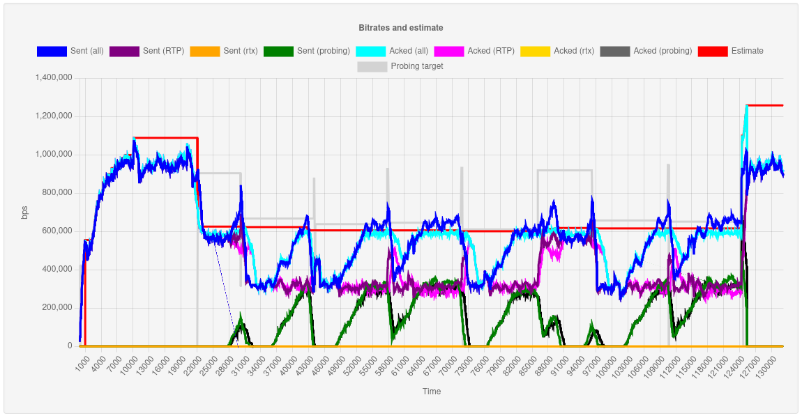
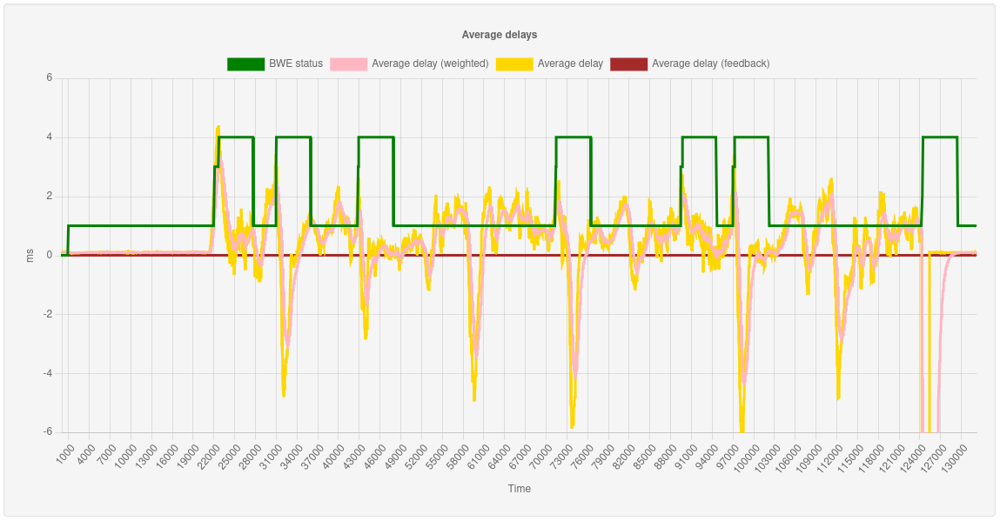

Janus BWE Stats
===============

This is a viewer for BWE (Bandwidth Estimation) stats originated by the [Janus WebRTC Server](https://github.com/meetecho/janus-gateway/), specifically for stats that can be originated by [this PR](https://github.com/meetecho/janus-gateway/pull/3278) (which at the time of writing hasn't been merged yet). You can find more information on the integration of BWE in Janus in [this presentation](https://www.youtube.com/watch?v=7L35Q_5aqCc) and [this blog post](https://www.meetecho.com/blog/bwe-janus/).

It's a web application that uses [Chart.js](https://www.chartjs.org/) to display the data, and it was created as a helper tool to debug and study BWE sessions, in order to try and tweak/improve the new BWE algorithm in Janus. It works by either importing offline captures, through pre-saved CSV files, or by showing stats live, if using live injection of stats via UDP. Notice that, since this is currently a prototype, only a single live session can be active at any given time: maybe in the future I'll make this more flexible, but it's currently not a priority.

The project was inspired by Sergio Garcia Murillo's [bwe-stats-viewer](https://github.com/medooze/bwe-stats-viewer), that was created for Medooze for the same purpose. Initially the idea was to leverage Sergio's effort directly too, but since not all the parameters we needed were there, and we wanted to be more in control of what to display, we decided to try and create something new instead. Hopefully in the future the two efforts may somehow merge, to provide a more agnostic BWE stats viewer that different servers can refer to and benefit from.

# Installation

The server requires [Node.js](https://nodejs.org/) to run. In theory any version should work, even though I've used v16.x locally.

To install the dependencies, run:

	npm run build

# Configuration

The application requires a configuration file in `src/config.js`. A template is provided in `src/config.template.js`, that can be copied to `src/config.js` by running:

	npm run build-config

The templace will come with placeholder values that need to be set properly. There's just two parameters that need to be specified:

* `api_port`: the port the application will bind to for the web application backend;
* `udp_port`: the port the application will bind to for getting live stats (optional).

# Starting

You can start the server using the following command:

	npm start

which will use a limited amount of debugging. In case you're interested in a more verbose instance, you can use this command instead:

	npm run start-debug

When started, the server will expose a web interface that can be interacted with using socket.io. Assuming `8070` was used for the `api_port`, a local instance of the server would be reachable at this base address:

	http://localhost:8070

# Collecting stats

This application needs BWE stats from Janus in order to work. By default, Janus will not gather any stats for sessions where BWE is enabled: you need to enable them dynamically, using the Admin API. The format of the messages to enable/disable stats is the following:

	{
		"janus": "debug_bwe",
		"transaction": "<random string>",
		"admin_secret": "<Admin API secret>",
		"csv": <true|false, whether to save stats to a CSV file>,
		"path": "<in case csv is true, full pathname to where to save the file>",
		"live": <true|false, whether to relay live stats via UDP>,
		"host": "<in case live is true, host/IP to send the stats to>",
		"port": "<in case live is true, UDP port to send the stats to>"
	}

The following is a very simple snippet that can be added to the VideoRoom demo code, specifically right after creating a subscriber instance, to automatically save stats for debugging purposes. Notice that this snippet is just for debugging, since it exposes the Admin API to the client side application: a better way to do that is sending Admin API requests from an authorized backend instead.

	// FIXME BWE debugging
	Janus.httpAPICall("http://localhost:7088/admin/" + janus.getSessionId() + "/" + remoteFeed.getId(), {
		verb: 'POST',
		withCredentials: false,
		body: {
			janus: 'debug_bwe',
			transaction: Janus.randomString(8),
			admin_secret: 'janusoverlord',
			csv: true,
				path: '/tmp/bwe-' + Date.now() + '-' + remoteFeed.getId() + '.csv',
			live: true,
				host: '127.0.0.1',
				port: 8878
		},
		success: function(json) {
			Janus.vdebug(json);
		},
		error: function(textStatus, errorThrown) {
			Janus.error(textStatus + ": " + errorThrown);	// FIXME
		}
	});

This snippet is instructing Janus to save both offline stats (to a CSV file in `/tmp`) and doing live stats (to `127.0.0.1:8878`, since `udp_port` was set to `8878`). Of course you can choose to do only one, rather than both. Remember that at the moment live stats will NOT work if multiple sessions are pushing stats at the same time; there's no limits to how many session can have their stats saved to CSV at the same time, instead.

## Content of the stats

Whether offline or live, stats are always formatted in CSV style, with comma separated properties. The attributes each row provides are the following:

* `time`: relative time of this stat, in microseconds, from the start (which will be `0`);
* `status`: current state of the BWE context (0=start, 1=regular, 2=lossy, 3=congested, 4=recovering);
* `estimate`: current BWE estimate, in bps;
* `probing_target`: current probing target, as set by the responsible Janus plugin, in bps;
* `bitrate_out`: amount of RTP data (handled by TWCC) that Janus has sent in the last second, in bps;
* `rtx_out`: portion of `bitrate_out` that were retransmissions (rtx);
* `probing_out`: portion of `bitrate_in` that was probing;
* `bitrate_in`: amount of RTP data that the recipient acknowledged they received in the last second, in bps;
* `rtx_in`: portion of `bitrate_out` that was related to retransmissions (rtx);
* `probing_in`: portion of `bitrate_out` that was related to probing traffic;
* `acked`: number of packets that were acknowledged since the last received TWCC feedback (unused in this stats viewer);
* `lost`: number of packets that were apparently lost since the last received TWCC feedback (unused in this stats viewer);
* `loss_ratio`: ratio of lost packets since the last TWCC received feedback (unused in the stats viewer);
* `avg_delay`: average delay in the last second;
* `avg_delay_weighted`: weighted average delay;
* `avg_delay_fb`: average delay in the last received TWCC feedback.

CSV files will have the names of the properties in the first row, followed by all the collected stats (meaning it can adapt if properties are out of order); live stats will only contain the stats themselves (one per message), which means the backend will assume the structure above is valid.

## Analyzing offline stats

To use the stats viewer in offline mode, you should put CSV stats generated by Janus in a `stats` subfolder. There's no integrated file picker right now (this may be added later on), which means that it's up to you to load them manually. Using the JavaScript console, use the following command:

	loadData('<name of the CSV file>')

This will send a message to the backend, requesting the specified CSV file via socket.io. Notice that only the name of the file is required, since it will be automatically looked up in the `stats` subfolder. If the CSV file is available, its content will be returned back and presented visually.

Two different graphs will be created: one displaying different bitrates, and another displaying delay-related information. Both graphs will use the same time base, and will be in sync. You can zoom the results by dragging horizontally on the stats on the area you want to focus on: if you zoom on one graph, the other will zoom to the same time range as well. A button to reset the zoom will appear on top of the first graph.

You can at any time change the graph you're analyzing by using the same `loadData()` command with a different CSV file.

## Testing with live stats

If you want to debug a BWE session in real-time, use the same `loadData()` command but passing an empty string:

	loadData('')

This will instruct the backend to relay back to the application any stat that Janus is pushing live to `udp_port`. Notice that, although you can have multiple viewers for the same live session, you can not have multiple sessions put live stats to the backend at the same time: this is because, at the moment, there's no concept of "session", so the backend blindly relays whatever stats is being sent to `udp_port`, and those stats don't have context information. In the future, this may be changed to make it more flexible.

As before, a new `loadData()` command will reset the graphs and display something different, which will allow you to move from offline to live stats and viceversa dynamically.
